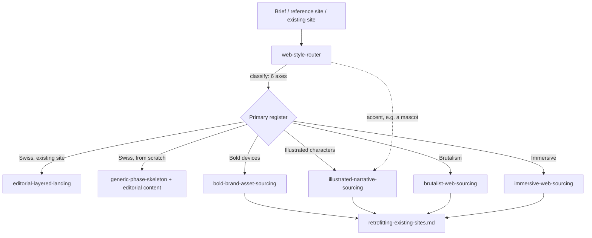

# super-enigma

A family of [Claude Agent Skills](https://docs.claude.com/en/docs/agents-and-tools/agent-skills/overview) for web design work — one skill per major visual register, plus a router that classifies a brief and dispatches to the right one(s).

The four registers map to the archetypes documented by [Web Design Lookbook](https://webdesignlookbook.webflow.io/) (Swiss, Illustrative Pop, Brutalism, Immersive) — this family was built out from studying that taxonomy and noticing where existing tooling stopped short of it.

## The family

| Skill | Register | Scope |
|---|---|---|
| `editorial-layered-landing` | Swiss / editorial | Full structure + style. Upgrades an *existing* static site into a premium editorial landing — layered composition, large type, subtle scroll reveal. Does not build from scratch by design. |
| `bold-brand-asset-sourcing` | Illustrative Pop — graphic devices | Materials only. Seals, stars, squiggles, grain, marquees — the "creative studio bold" kit. Works for new builds or retrofits. |
| `illustrated-narrative-sourcing` | Illustrative Pop — character illustration | Materials only. Custom character/scene illustration where the drawing *is* the story — model sheets, consistency, AI-generation technique, rights. |
| `brutalist-web-sourcing` | Brutalism | Materials only. Raw, exposed, anti-corporate — thick borders, hard offset shadows, deliberate rawness with a hard legibility gate underneath. |
| `immersive-web-sourcing` | Immersive / 3D | Materials only. WebGL/3D, scroll-driven camera, particles — with an accessible-fallback gate as the central discipline. |
| `web-style-router` | — (dispatcher) | Classifies a brief against the four registers (six-axis framework), handles primary + accent blends, routes to the right skill(s), and supplies a generic project-phase skeleton for any register that doesn't bundle its own (i.e., everything except editorial-layered-landing). |

Each sourcing skill is governed by its own three-part rule (cohesion/license/weight for
bold-brand, consistency/rights/weight for illustrated-narrative, deliberate/legible/light
for brutalist, fallback/spectacle/budget for immersive) — the specific way each register
tends to go wrong, encoded as a check rather than left implicit.

## Architecture

`retrofitting-existing-sites.md` (inside `bold-brand-asset-sourcing/references/`) is a
shared pre-flight audit — existing CSS variables and theming mechanism, CSP, existing
scroll/motion systems, single- vs. multi-page structure — used by all four
materials-only skills whenever the project is landing on a site that already works,
which in practice is the common case.

## Using this with a broader project workflow

If you also use a higher-level orchestrator skill (a "plan the whole website build"
type skill covering discovery → architecture → brand → content → dev → SEO → QA →
launch), this family is meant to plug into that orchestrator's brand/design and
development phases, not replace it — run `web-style-router` there to decide the
register(s), then let the routed skill(s) supply that phase's actual content.

## Install

**Claude.ai / claude.ai skills**: package each skill folder as a `.skill` file and use
"Save skill", or point Claude at this repo and ask it to load the relevant one.

**Claude Code / other agent runtimes**: drop the skill folders into wherever your
runtime discovers skills from (commonly a `skills/` directory alongside your project or
in a global config path) — check your runtime's docs for the exact location.

Each `SKILL.md` has YAML frontmatter (`name`, `description`) that agents use to decide
when to load it, plus `references/` files loaded on demand rather than all at once.

## Attribution

The four-register taxonomy is drawn from [Web Design Lookbook](https://webdesignlookbook.webflow.io/)
by Ozge Keles. The skills themselves — the sourcing catalogs, the governing rules, the
code patterns — are original work built for this repo, not reproduced from that site.

## License

TODO — pick a license before making this public (MIT is a reasonable default for
instructional/reference content like this).
